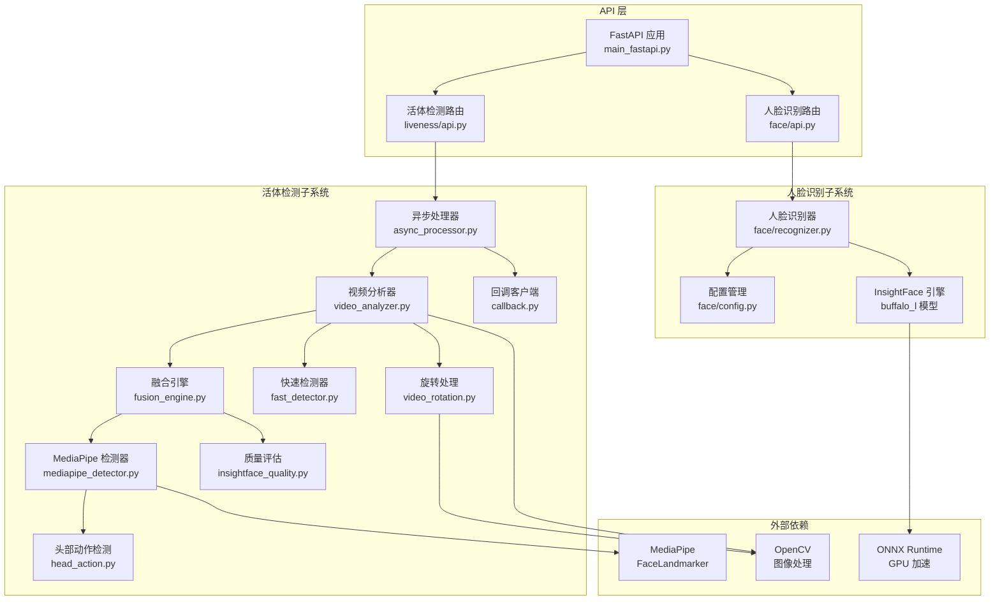
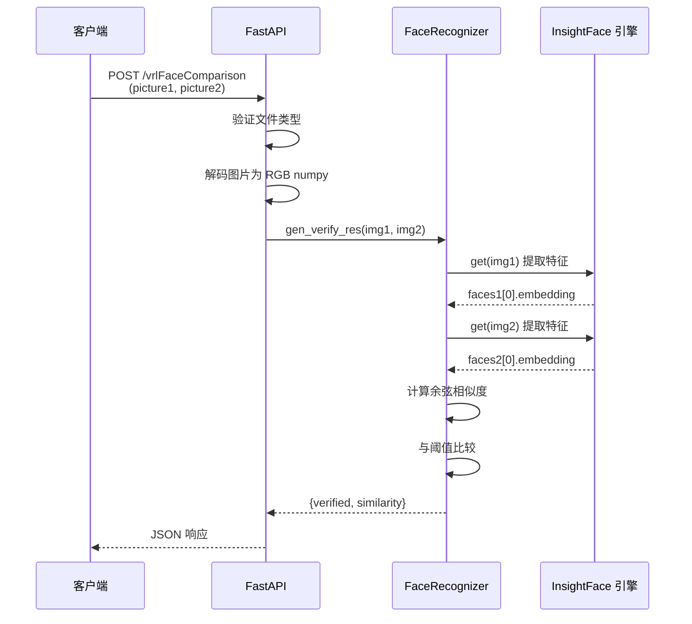
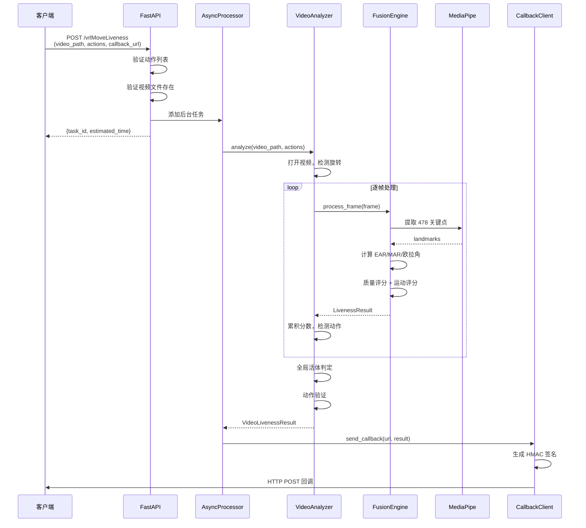
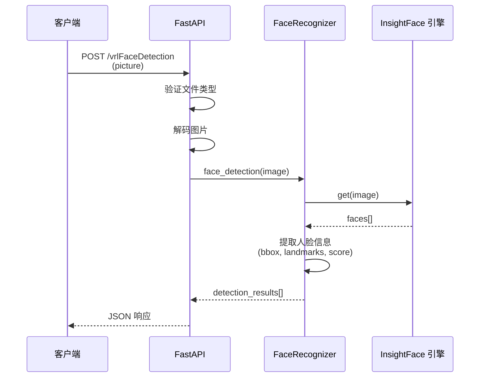
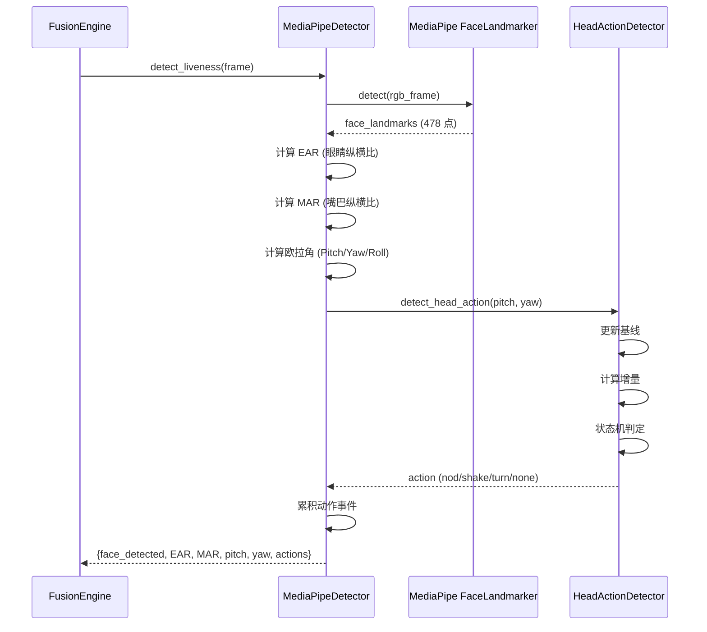
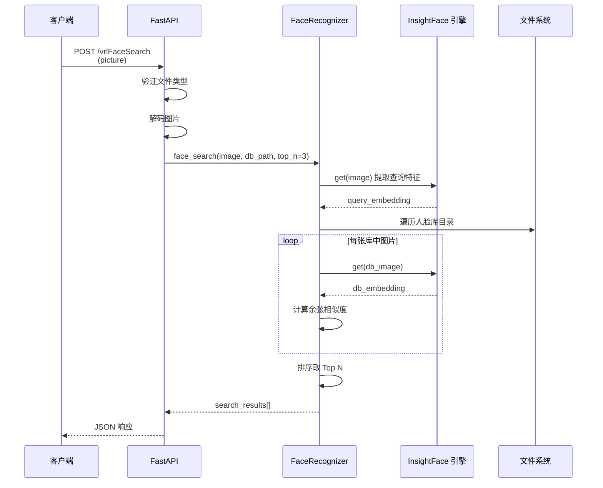
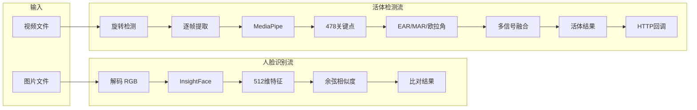

# vrlFace 系统架构文档

## 📋 概述

vrlFace 是一个基于 **InsightFace + MediaPipe** 的高性能人脸识别与活体检测系统，提供 RESTful API 服务。系统采用模块化设计，分为两大核心子系统：

- **人脸识别子系统** (`vrlFace.face`) - 基于 InsightFace 的人脸检测、1:1 比对、1:N 搜索
- **活体检测子系统** (`vrlFace.liveness`) - 基于 MediaPipe 的视频活体检测与动作验证

## 🏗️ 系统架构图



## 🔷 功能模块详解

### 1. API 服务层

**入口**: `vrlFace/main_fastapi.py`

提供统一的 FastAPI 应用，整合人脸识别和活体检测两大路由：

- `/healthz` - 健康检查
- `/vrlFaceDetection` - 人脸检测
- `/vrlFaceComparison` - 1:1 人脸比对
- `/vrlFaceSearch` - 1:N 人脸搜索
- `/vrlFaceIdComparison` - 人证比对
- `/vrlMoveLiveness` - 视频活体检测（异步回调）

### 2. 人脸识别子系统

**核心模块**: `vrlFace/face/`

#### 2.1 核心组件

- **recognizer.py** - 人脸识别核心逻辑
  - `face_detection()` - 人脸检测，返回人脸位置和特征
  - `gen_verify_res()` - 1:1 比对，计算余弦相似度
  - `face_search()` - 1:N 搜索，在人脸库中查找最相似人脸
  - 使用 InsightFace buffalo_l 模型提取 512 维特征向量

- **config.py** - 配置管理
  - 支持环境变量配置（`FACE_MODEL_NAME`, `FACE_GPU_ID` 等）
  - 相似度阈值：默认 0.55（普通比对）、0.70（人证比对）
  - GPU/CPU 自动切换

- **api.py** - FastAPI 路由
  - 文件上传处理（支持 JPEG/PNG/WEBP/BMP）
  - 图像预处理（RGB 转换）
  - 异常处理和日志记录

#### 2.2 技术特点

- 单例模式管理 InsightFace 实例，避免重复加载
- 支持图片路径和 numpy 数组两种输入
- 余弦相似度计算，阈值可配置
- 人脸库基于文件系统，支持快速搜索

### 3. 活体检测子系统

**核心模块**: `vrlFace/liveness/`

#### 3.1 核心组件

- **async_processor.py** - 异步任务处理器
  - 接收活体检测任务请求
  - 后台异步处理视频
  - 完成后通过 HTTP 回调通知前端

- **video_analyzer.py** - 视频分析器
  - 逐帧读取视频并分析
  - 支持自动旋转检测和修正
  - 按动作时间段分段分析
  - 全局活体判定 + 单动作验证

- **fusion_engine.py** - 多信号融合引擎
  - 整合 MediaPipe 检测结果
  - 质量评分（人脸尺寸、亮度）
  - 运动评分（眨眼、张嘴、头部动作）
  - 时序平滑（滑动窗口）

- **mediapipe_detector.py** - MediaPipe 检测器
  - 使用 MediaPipe FaceLandmarker 提取 478 个关键点
  - EAR（Eye Aspect Ratio）计算眨眼
  - MAR（Mouth Aspect Ratio）计算张嘴
  - 欧拉角（Pitch/Yaw/Roll）计算头部姿态

- **fast_detector.py** - 快速状态机检测器
  - 轻量级动作检测，无需 MediaPipe
  - 基于阈值的状态机
  - 适用于低延迟场景

- **head_action.py** - 头部动作事件检测
  - 基线跟踪（EMA 平滑）
  - 事件触发（点头、摇头、左转、右转）
  - 防误触发（确认帧、冷却期）

- **callback.py** - 回调客户端
  - HMAC-SHA256 签名
  - HTTP POST 异步回调
  - 重试机制（可配置）

- **video_rotation.py** - 视频旋转处理
  - 自动检测视频旋转元数据
  - 支持 0/90/180/270 度旋转
  - 修正显示方向

#### 3.2 技术特点

- 同步推理消除延迟，避免短暂动作漏检
- 多信号融合提高准确率
- 支持动作序列验证（眨眼 → 点头 → 摇头）
- 自动处理旋转视频
- 异步回调架构，支持长视频处理

### 4. 配置管理

**模块**: `vrlFace/face/config.py`, `vrlFace/liveness/config.py`

#### 4.1 人脸识别配置

```python
FACE_MODEL_NAME=buffalo_l      # 模型名称
FACE_DET_SIZE=640,640          # 检测尺寸
FACE_GPU_ID=-1                 # GPU ID（-1=CPU）
FACE_THRESHOLD=0.55            # 相似度阈值
FACE_IMAGES_BASE=/app/data     # 人脸库路径
```

#### 4.2 活体检测配置

预设配置：
- `cpu_fast_config()` - CPU 快速模式
- `realtime_config()` - 实时摄像头模式
- `video_anti_spoofing_config()` - 视频防伪模式
- `video_fast_config()` - 视频快速模式

关键参数：
- `ear_threshold` - 眨眼阈值（默认 0.20）
- `mar_threshold` - 张嘴阈值（默认 0.55）
- `yaw_threshold` - 左右转头阈值（默认 15°）
- `pitch_threshold` - 上下点头阈值（默认 15°）
- `window_size` - 滑动窗口大小（默认 30 帧）

## 🔄 关键执行流程

### 流程 1: 人脸 1:1 比对



### 流程 2: 视频活体检测（异步回调）



### 流程 3: 人脸检测



### 流程 4: MediaPipe 关键点检测



### 流程 5: 1:N 人脸搜索



## 📊 数据流图



## 🔧 技术栈

| 层级 | 技术 | 用途 |
|------|------|------|
| Web 框架 | FastAPI + Uvicorn | RESTful API 服务 |
| 人脸识别 | InsightFace (buffalo_l) | 人脸检测、特征提取 |
| 活体检测 | MediaPipe FaceLandmarker | 面部关键点检测 |
| 图像处理 | OpenCV (cv2) | 视频读取、图像变换 |
| 模型推理 | ONNX Runtime | GPU 加速推理 |
| 数值计算 | NumPy | 向量运算、相似度计算 |
| 异步处理 | asyncio + BackgroundTasks | 后台任务、异步回调 |
| HTTP 客户端 | httpx | 异步 HTTP 请求 |
| 包管理 | uv | 依赖管理、虚拟环境 |

## 🚀 部署架构

### 单端口部署（推荐）

```
uvicorn vrlFace.main_fastapi:app --host 0.0.0.0 --port 8070
```

所有接口统一在 8070 端口。

### 双端口部署（可选）

```bash
# 人脸识别服务
uvicorn vrlFace.face_app:app --host 0.0.0.0 --port 8070

# 活体检测服务
uvicorn vrlFace.liveness_app:app --host 0.0.0.0 --port 8071
```

独立部署，便于扩展和负载均衡。

### Docker 部署

```bash
# 开发环境（热重载）
cd deploy/dev && bash up.sh

# 生产环境（多 worker）
cd deploy/pro && bash up.sh
```

## 📈 性能优化

### 人脸识别优化

1. **单例模式** - InsightFace 实例复用，避免重复加载模型
2. **GPU 加速** - 使用 ONNX Runtime GPU 提升推理速度
3. **检测尺寸** - 默认 640x640，平衡速度与精度
4. **批量处理** - 支持批量特征提取（1:N 搜索）

### 活体检测优化

1. **同步推理** - 消除后台线程延迟，避免短暂动作漏检
2. **跳帧处理** - 可配置跳帧减少计算量
3. **图像缩放** - 推理前缩放到最大宽度（默认 1280）
4. **滑动窗口** - 时序平滑，减少抖动
5. **状态机** - 快速检测器使用状态机，降低计算复杂度

## 🔒 安全特性

1. **文件类型验证** - 仅允许 JPEG/PNG/WEBP/BMP
2. **路径安全检查** - 验证视频文件存在性
3. **动作白名单** - 仅支持预定义动作类型
4. **HMAC 签名** - 回调请求使用 HMAC-SHA256 签名
5. **环境变量配置** - 敏感信息通过环境变量管理
6. **异常处理** - 完善的错误处理和日志记录

## 📝 配置建议

### 人脸识别场景

| 场景 | 阈值 | 说明 |
|------|------|------|
| 普通比对 | 0.55 | 日常应用，平衡准确率和召回率 |
| 人证比对 | 0.70 | 高安全场景，降低误识率 |
| 宽松模式 | 0.40 | 提高召回率，适用于初筛 |

### 活体检测场景

| 场景 | 配置 | 说明 |
|------|------|------|
| 实时摄像头 | `realtime_config()` | 低延迟，适合交互式验证 |
| 视频防伪 | `video_anti_spoofing_config()` | 高精度，适合离线审核 |
| CPU 快速 | `cpu_fast_config()` | 无 GPU 环境，快速检测 |
| 视频快速 | `video_fast_config()` | 批量处理，平衡速度与精度 |

## 🔍 监控与日志

### 日志级别

- **INFO** - 请求日志、任务状态
- **WARNING** - 验证失败、回调失败
- **ERROR** - 异常堆栈、系统错误

### 关键指标

- 请求响应时间
- 人脸检测成功率
- 活体检测通过率
- 回调成功率
- GPU 利用率

## 📚 扩展性

### 水平扩展

- 无状态设计，支持多实例部署
- 负载均衡器分发请求
- 共享人脸库（NFS/对象存储）

### 功能扩展

- 新增动作类型（修改 `ACTION_ALIASES`）
- 自定义检测器（实现 `BaseLivenessDetector`）
- 新增 API 端点（扩展 `router`）

## 🎯 最佳实践

1. **生产环境使用 GPU** - 显著提升推理速度
2. **合理设置阈值** - 根据业务场景调整相似度阈值
3. **监控回调失败** - 配置重试机制和告警
4. **定期更新模型** - 关注 InsightFace 新版本
5. **日志分级存储** - ERROR 日志单独存储便于排查
6. **健康检查** - 使用 `/healthz` 端点监控服务状态

---

**文档版本**: 1.0  
**最后更新**: 2026-03-12  
**维护者**: vrlFace 开发团队
